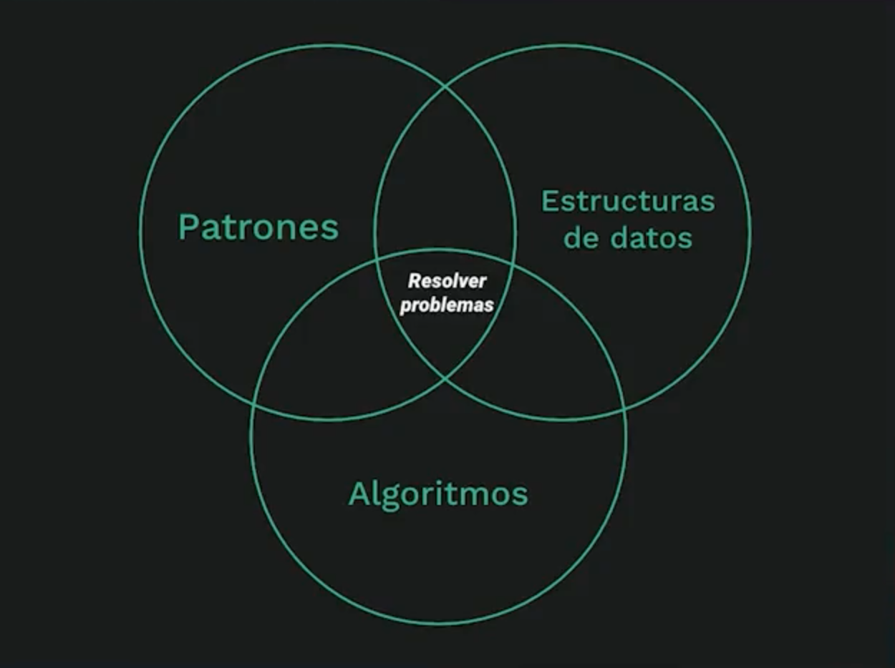

# Curso de Entrevistas Técnicas: Estructuras de Datos y Algoritmos Avanzados
## ¿Qué estructuras de datos y algoritmos aprender?

### Estructuras de datos
- Arreglos
- Strings
- Listas encadenadas
- Tablas hash y conjuntos de hash
- Pilas
- Colas
- Árboles
- Grafos
- Tries

### Conceptos y Algorimos
- Notación Big O
- Algoritmos de ordenamiento
- Algoritmos de búsqueda
- DFS y BFS
- Manipulación de bits
- Recursión
- Programación dinámica

### Patrones
- Dos apuntadores
- Ventana deslizante
- Apuntador rápido y lento

Entre otros...

## ¿Cómo es (comúnmente) una entrevista con problemas de programación?

### Criterioes de evaluación en empresas grandes de tecnología:

1. Comunicación, cómo expresas lo que haces al solucionar y preguntar, trabajar en equipo, retroalimentación
2. Conocimiento técnico, qué es lo que haces o sabes para solucionar, calidad
3. Pruebas, qué clase de pruebas haces que sea coherente, como pruebas de escritorio
4. Capacidad de resolución de problemas, Cómo refactorizas y lo haces bien eficiente, casos de uso como de desuso.

### 5 pasos para resolver problemas de programación durante entrevistas

1. Hacer preguntas
2. Identiificar los casos de uso (incluso los extraños).
3. Diseñar la solución (aún no implementarla).
4. Implementar (ahora sí).
5. Probar el código

### Tips para la ejecución de entrevistas
- No empezar a programar de inmediato
- No escribir pseudocódigo
- Escoger un lenguaje con el que se sienta cómodo
- Entender el problema
- Ponerse metas
- Practicar, resolver muchos problemas
- Escribir código elegante, limpio y bonito
- Nombres de variables
- Probar el código

